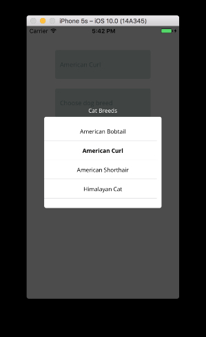

## SwiftListView
Collection of simple &amp; neutral list views for IOS written in Swift.

## Features

* Animated
* Set static items or define a data loader
* Works on both iPhone and iPad
* Supports orientation change
* Helper button ( GroupFilterButton )

## Installation

* Add ```github "hemantasapkota/SwiftListView"``` to your ```cartfile```
* Execute ```carthage update```

**Note**: SwiftListView includes other libraries as dependencies. Carthage will pull and build them. You must include all the dependencies to your project. 

## List Views

### BasicListView



### Usage - Static List

```swift
var highlighted = "Himalayan Cat"

let listView = BasicListView(viewTitle: "Cat Breeds", highlighted: highlighted)
listView.Items = ["American Bobtail", "American Curl", "American Shorthair", "Himalayan Cat"]

listView.onSelection = { selected in  

  // Do something with the selected item. Ex: Update UI
  self.basicListViewBtn.titleLabel?.text = selected

  self.highlighted = selected
}

listView.show()

```

### Usage - Dynamic List

```swift
let listView = BasicListView(viewTitle: "", highlighted: "")

listView.ShowProgress = true

listView.ItemsLoader = { (completion) in
    // Load the data asynchronously and call the completion block with the returned array
    // Mock example
    GCDTimer.delay(0.8, block: {
        listView.ShowProgress = false
        completion!(["Dog Breed", "Labrador Retriever", "German Shepherd"))
    })
}

listView.show()
```
## Buttons

### GroupFilterButton

A simple custom button that pairs well with the list views.

Example:
```swift
        var selectedCat = ""
        
        showCatBreed = GroupFilterButton()
        showCatBreed.SelectedText = "Choose Cat Breed"
        showCatBreed.onSelection = { selected in
            let listView = BasicListView(viewTitle: "Cat Breeds", highlighted: selectedCat)
            
            listView.Items = ["American Bobtail", "American Curl", "American Shorthair", "Himalayan Cat"]
            listView.onSelection = { selected in
                self.showCatBreed.SelectedText = selected
                selectedCat = selected
            }
            
            listView.show()
            
        }
```

GroupFilterButton comes with default foreground and background colors, which can be customized.

#### Change Background Color

```swift
showCatBreed.backgroundColor = UIColor()
```

#### Change Border Color

```swift
showCatBreed.layer.borderColor = UIColor(....).cgColor
```

#### Change Text Color

```swift
showCatBreed.label.textColor = UIColor(.....)
```

### Author ###
* [Hemanta Sapkota](https://twitter.com/ozhemanta) / [Blog](http://hemantasapkota.github.io/) / [Linked In](https://au.linkedin.com/in/hemantasapkota)

### License ###
The MIT License (MIT)

Copyright (c) 2016 Hemanta Sapkota

Permission is hereby granted, free of charge, to any person obtaining a copy
of this software and associated documentation files (the "Software"), to deal
in the Software without restriction, including without limitation the rights
to use, copy, modify, merge, publish, distribute, sublicense, and/or sell
copies of the Software, and to permit persons to whom the Software is
furnished to do so, subject to the following conditions:

The above copyright notice and this permission notice shall be included in all
copies or substantial portions of the Software.

THE SOFTWARE IS PROVIDED "AS IS", WITHOUT WARRANTY OF ANY KIND, EXPRESS OR
IMPLIED, INCLUDING BUT NOT LIMITED TO THE WARRANTIES OF MERCHANTABILITY,
FITNESS FOR A PARTICULAR PURPOSE AND NONINFRINGEMENT. IN NO EVENT SHALL THE
AUTHORS OR COPYRIGHT HOLDERS BE LIABLE FOR ANY CLAIM, DAMAGES OR OTHER
LIABILITY, WHETHER IN AN ACTION OF CONTRACT, TORT OR OTHERWISE, ARISING FROM,
OUT OF OR IN CONNECTION WITH THE SOFTWARE OR THE USE OR OTHER DEALINGS IN THE
SOFTWARE.
